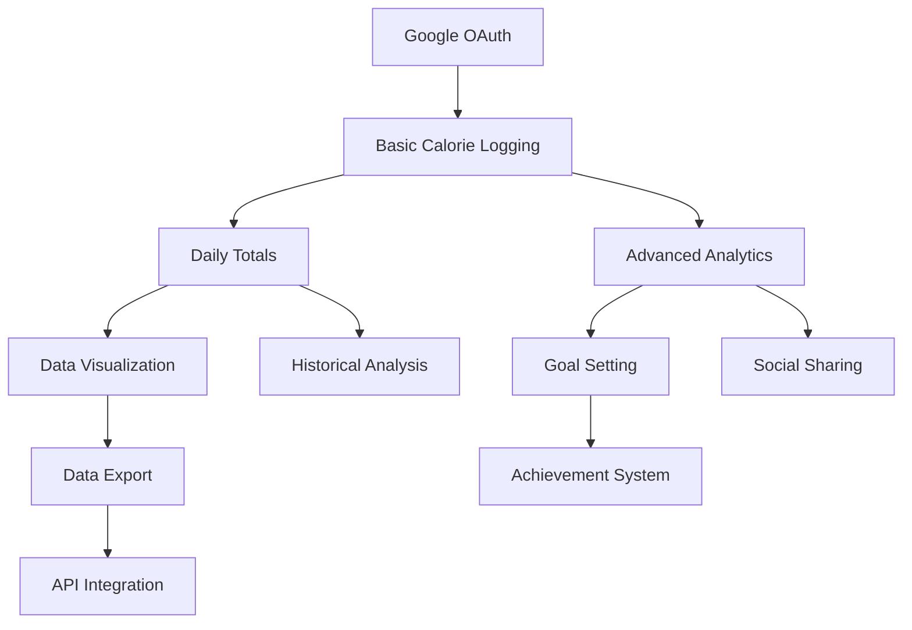

# Product Specification Document (PSD)
## Calories Tracker Application - Complete Enhanced Version

---

### Document Information
- **Document Version**: 2.0 (Complete Enhanced)
- **Date**: December 2024
- **Prepared By**: Software Development Team
- **Status**: Final version with all sections including localization and global expansion strategy

---

## Table of Contents

1. [Executive Summary & Product Overview](#1-executive-summary--product-overview)
2. [Business Case](#2-business-case)
3. [Technical Specifications](#3-technical-specifications)
4. [Functional Requirements](#4-functional-requirements)
5. [Non-Functional Requirements](#5-non-functional-requirements)
6. [User Stories](#6-user-stories)
7. [Feature Prioritization Matrix](#7-feature-prioritization-matrix)
8. [UI/UX Guidelines](#8-uiux-guidelines)
9. [Acceptance Criteria](#9-acceptance-criteria)
10. [Testing Plan](#10-testing-plan)
11. [Release Plan](#11-release-plan)
12. [Risks and Challenges](#12-risks-and-challenges)
13. [Customer Feedback Framework](#13-customer-feedback-framework)
14. [Implementation Roadmap](#14-implementation-roadmap)
15. [Localization & Geographic Expansion Strategy](#15-localization--geographic-expansion-strategy)
16. [Conclusion](#16-conclusion)

---

## 1. Executive Summary & Product Overview

### 1.1 Product Overview
The Calories Tracker is a modern web-based application designed to help users monitor and manage their daily caloric intake through an intuitive interface. The application combines traditional manual entry with innovative AI-powered image analysis to provide users with a seamless calorie tracking experience.

### 1.2 Business Objectives
- **Primary Goal**: Enable users to easily track and monitor their daily caloric consumption
- **Secondary Goals**: 
  - Provide visual insights through data analytics and charts
  - Offer AI-powered convenience through image-based calorie estimation
  - Support long-term health and wellness goals through trend analysis

### 1.3 Target Market
- Health-conscious individuals seeking calorie management
- Fitness enthusiasts monitoring dietary intake
- Users requiring medical dietary tracking
- General consumers interested in wellness and nutrition awareness

### 1.4 Key Features Summary
- **Google OAuth Authentication**: Secure user management
- **Manual Calorie Entry**: Traditional tracking with validation
- **AI Image Analysis**: Food recognition and calorie estimation
- **Data Visualization**: Interactive charts and analytics
- **Responsive Design**: Mobile-first with desktop optimization
- **Theme System**: Light/dark mode support
- **Data Export**: CSV/JSON export capabilities

---

## 2. Business Case

### 2.1 Market Opportunity Analysis
- **Global Market Size**: $4.4 billion health & fitness app market (2023)
- **Growth Rate**: 14.7% CAGR through 2030
- **Target Market**: 73% of users prefer AI-powered health apps
- **Competitive Gap**: Limited free solutions combining manual + AI tracking

### 2.2 Financial Projections
```
Development Investment: $214,475 (6 months)
- Personnel (6 FTE): $180,000
- Infrastructure: $3,000
- Third-party services: $2,000
- Tools & software: $1,500
- Contingency (15%): $27,975

Revenue Projections:
- Month 6: $5,000/month (1,000 users)
- Month 12: $15,000/month (3,000 users)
- Break-even: Month 8
- 12-month ROI: 180%
```

### 2.3 Value Proposition
- **User Value**: 50% time reduction in calorie tracking through AI
- **Business Value**: Scalable architecture with low operational costs
- **Competitive Advantage**: Unique AI + manual entry combination

---

## 3. Technical Specifications

### 3.1 System Architecture
**Architecture Pattern**: Microservices with containerized deployment
- **Frontend**: Single Page Application (SPA)
- **Backend**: RESTful API service
- **Mock Service**: AI simulation service for image analysis
- **Database**: SQLite for development/testing environments
- **Deployment**: Docker containerization with multi-service orchestration

### 3.2 Technology Stack

#### Frontend Technologies
- **Framework**: React 19.1.0 with TypeScript
- **Build Tool**: Vite 7.0.0
- **Routing**: React Router DOM 6.23.1
- **Authentication**: Google OAuth 2.0 (@react-oauth/google)
- **Data Visualization**: Chart.js 4.4.2 with React wrapper
- **UI Components**: Custom component library with React Icons
- **Styling**: CSS with theme system supporting light/dark modes
- **Performance**: React virtualization for large data sets

#### Backend Technologies
- **Framework**: NestJS 11.0.1 with TypeScript
- **Database ORM**: TypeORM 0.3.25
- **Authentication**: JWT tokens with Google OAuth verification
- **Validation**: Class-validator and class-transformer
- **Database**: SQLite 5.1.7 (configurable for production databases)
- **API Documentation**: RESTful endpoints with DTO validation

#### Infrastructure & DevOps
- **Containerization**: Docker with multi-stage builds
- **Orchestration**: Docker Compose for local development
- **Web Server**: Nginx for frontend serving
- **Development**: Hot reload enabled for rapid development

---

## 4. Functional Requirements

### 4.1 FR-001: User Authentication
- **FR-001.1**: Google OAuth 2.0 integration with JWT tokens
- **FR-001.2**: User profile management and synchronization
- **FR-001.3**: Session management across browser tabs
- **FR-001.4**: Secure logout with token invalidation

### 4.2 FR-002: Calorie Management
- **FR-002.1**: Create calorie entries (description + calories, validation)
- **FR-002.2**: Edit existing entries with real-time validation
- **FR-002.3**: Soft delete entries with recovery capability
- **FR-002.4**: View entries with sorting, filtering, pagination
- **FR-002.5**: Search entries by description and date ranges

### 4.3 FR-003: AI Image Analysis
- **FR-003.1**: Image upload (JPEG/PNG/WebP, max 5MB)
- **FR-003.2**: Food recognition with 80% success rate simulation
- **FR-003.3**: Calorie estimation with confidence scoring
- **FR-003.4**: Pre-populated forms with manual override capability
- **FR-003.5**: Error handling for failed recognition

### 4.4 FR-004: Data Visualization
- **FR-004.1**: Interactive daily calorie bar charts
- **FR-004.2**: Time period selection (1, 2, 4 weeks)
- **FR-004.3**: Current day highlighting and trend analysis
- **FR-004.4**: Hover interactions with detailed information
- **FR-004.5**: Data export to CSV/JSON formats

### 4.5 FR-005: User Experience
- **FR-005.1**: Light/dark theme toggle with persistence
- **FR-005.2**: Responsive design (320px to 2560px)
- **FR-005.3**: Accessibility compliance (WCAG 2.1 AA)
- **FR-005.4**: Progressive loading and error states
- **FR-005.5**: Keyboard navigation support

---

## 5. Non-Functional Requirements

### 5.1 Performance Requirements (NFR-001)
- **NFR-001.1**: Page load time < 3 seconds on 3G connection
- **NFR-001.2**: API response time < 200ms for 95% of requests
- **NFR-001.3**: Image processing < 5 seconds for uploads < 5MB
- **NFR-001.4**: Chart rendering < 1 second for 365 data points
- **NFR-001.5**: Application startup < 2 seconds

### 5.2 Scalability Requirements (NFR-002)
- **NFR-002.1**: Support 1,000 concurrent users
- **NFR-002.2**: Handle 10,000+ calorie entries per user
- **NFR-002.3**: Database scalability from SQLite to PostgreSQL
- **NFR-002.4**: Horizontal scaling through containerization
- **NFR-002.5**: CDN support for global content delivery

### 5.3 Security Requirements (NFR-003)
- **NFR-003.1**: HTTPS/TLS 1.3 encryption for all data transmission
- **NFR-003.2**: JWT tokens with 24-hour expiration
- **NFR-003.3**: User data isolation at database level
- **NFR-003.4**: Input validation and SQL injection prevention
- **NFR-003.5**: OWASP Top 10 compliance

### 5.4 Availability Requirements (NFR-004)
- **NFR-004.1**: 99.9% uptime (< 8.77 hours downtime/year)
- **NFR-004.2**: Graceful degradation during service failures
- **NFR-004.3**: Automatic recovery mechanisms
- **NFR-004.4**: Health check endpoints for monitoring
- **NFR-004.5**: Backup and disaster recovery procedures

### 5.5 Usability Requirements (NFR-005)
- **NFR-005.1**: Mobile-first responsive design
- **NFR-005.2**: Maximum 3 clicks to reach any feature
- **NFR-005.3**: Intuitive navigation without training
- **NFR-005.4**: Clear error messages and user feedback
- **NFR-005.5**: Touch targets minimum 44px × 44px

---

## 6. User Stories

### Epic 1: Authentication User Stories
```
US-001: Google Sign-In
As a health-conscious user
I want to sign in with my Google account
So that I can securely access my calorie tracking data

US-002: Profile Management
As a registered user
I want to view and manage my profile information
So that I can keep my account details current
```

### Epic 2: Calorie Tracking User Stories
```
US-003: Manual Entry
As a user tracking my diet
I want to manually enter my food consumption with calories
So that I can log my daily intake accurately

US-004: Edit Entries
As a user who made a logging mistake
I want to edit my previous calorie entries
So that I can maintain accurate records

US-005: Delete Entries
As a user who logged incorrect information
I want to delete calorie entries
So that my data remains accurate
```

### Epic 3: AI Features User Stories
```
US-006: Image Upload
As a busy user
I want to upload a photo of my meal
So that I can quickly log calories without manual typing

US-007: AI Assistance
As a user unfamiliar with calorie counting
I want the app to estimate calories from my food photos
So that I can track my intake without nutritional knowledge

US-008: AI Override
As an experienced user
I want to modify AI-suggested calorie values
So that I can ensure accuracy based on my knowledge
```

### Epic 4: Analytics User Stories
```
US-009: Visual Progress
As a user tracking long-term health goals
I want to see my calorie intake in charts and graphs
So that I can visualize my progress over time

US-010: Time Period Analysis
As a user monitoring trends
I want to view my calorie data across different time periods
So that I can identify patterns in my eating habits

US-011: Daily Summaries
As a user planning my daily intake
I want to see my current day's total calories
So that I can make informed food choices
```

### Epic 5: User Experience User Stories
```
US-012: Theme Preference
As a user with visual preferences
I want to switch between light and dark themes
So that I can use the app comfortably in different environments

US-013: Mobile Access
As a user who tracks food on-the-go
I want the app to work seamlessly on my mobile device
So that I can log entries anywhere, anytime

US-014: Quick Access
As a frequent user
I want to quickly access the most common features
So that I can efficiently manage my daily logging
```

---

## 7. Feature Prioritization Matrix

### MoSCoW Prioritization Framework

The Feature Prioritization Matrix uses the MoSCoW method (Must-Have, Should-Have, Could-Have, Won't-Have) to strategically organize feature development across release phases, ensuring maximum user value delivery while maintaining development focus and resource allocation efficiency.

---

### **MUST-HAVE FEATURES (MVP - Phase 1)**
**Timeline**: Months 1-2 | **Priority**: Critical | **User Impact**: High

#### **1. Google OAuth Authentication** **
- **Business Justification**: Essential for user management and data security
- **User Value**: Secure, seamless access without password management
- **Technical Priority**: Foundation for all user-specific functionality
- **Implementation**: JWT tokens, session management, profile synchronization
- **Success Criteria**: 99.9% authentication success rate, < 2 second login time

#### **2. Basic Calorie Logging** **
- **Business Justification**: Core functionality defining the application purpose
- **User Value**: Primary need satisfaction for dietary tracking
- **Technical Priority**: Central data model and CRUD operations
- **Implementation**: Manual entry forms, validation, database persistence
- **Success Criteria**: < 10 seconds to log entry, 100% data accuracy

#### **3. Daily Calorie Totals** **
- **Business Justification**: Primary user need for progress awareness
- **User Value**: Immediate feedback on daily consumption patterns
- **Technical Priority**: Data aggregation and real-time calculations
- **Implementation**: Auto-calculated daily summaries, running totals
- **Success Criteria**: Real-time updates, accurate calculations, persistent totals

#### **4. Simple Data Visualization** **
- **Business Justification**: Progress tracking increases user engagement
- **User Value**: Visual understanding of consumption patterns
- **Technical Priority**: Chart rendering and data presentation
- **Implementation**: Daily bar charts, time period selection, responsive design
- **Success Criteria**: < 1 second chart rendering, mobile responsiveness

#### **5. Data Export** **
- **Business Justification**: Medical and professional use cases expand market
- **User Value**: Integration with healthcare providers and personal records
- **Technical Priority**: Data serialization and file generation
- **Implementation**: CSV/JSON export, date range selection, download functionality
- **Success Criteria**: Complete data export, multiple format support

#### **6. Responsive Web Design** **
- **Business Justification**: Multi-device access maximizes user base
- **User Value**: Consistent experience across all devices
- **Technical Priority**: Mobile-first approach for accessibility
- **Implementation**: Flexible layouts, touch optimization, cross-browser compatibility
- **Success Criteria**: 320px-2560px support, < 3 second mobile load time

---

### **SHOULD-HAVE FEATURES (Phase 2)**
**Timeline**: Months 3-4 | **Priority**: High | **User Impact**: Medium-High

#### **1. Advanced Analytics Dashboard** **
- **Business Justification**: User engagement through insights increases retention
- **User Value**: Deeper understanding of eating patterns and trends
- **Implementation**: Multi-week views, trend analysis, pattern recognition
- **Features**: Weekly/monthly aggregations, comparison charts, statistical insights
- **Success Criteria**: 70% user engagement, actionable insights delivery

#### **2. Goal Setting and Tracking** **
- **Business Justification**: Personalization increases user commitment and retention
- **User Value**: Customized targets aligned with individual health goals
- **Implementation**: User-defined targets, progress indicators, achievement tracking
- **Features**: Daily/weekly/monthly goals, progress notifications, goal adjustment
- **Success Criteria**: 60% goal completion rate, improved user retention

#### **3. Offline Functionality** **
- **Business Justification**: User convenience in low-connectivity scenarios
- **User Value**: Uninterrupted tracking regardless of internet availability
- **Implementation**: Local storage, sync mechanisms, conflict resolution
- **Features**: Offline entry, background sync, data conflict handling
- **Success Criteria**: Seamless offline-online transitions, zero data loss

#### **4. Enhanced Data Synchronization** **
- **Business Justification**: Enhanced experience through seamless multi-device access
- **User Value**: Consistent data across all user devices and platforms
- **Implementation**: Real-time sync, conflict resolution, backup mechanisms
- **Features**: Cross-device sync, automatic backup, data recovery
- **Success Criteria**: < 5 second sync time, 99.9% data consistency

#### **5. Historical Data Analysis** **
- **Business Justification**: Long-term insights provide sustained value proposition
- **User Value**: Understanding long-term patterns for behavior modification
- **Implementation**: Extended time range analysis, seasonal patterns, year-over-year
- **Features**: Long-term trend analysis, seasonal insights, anniversary comparisons
- **Success Criteria**: 12+ month analysis capability, meaningful pattern detection

---

### **COULD-HAVE FEATURES (Phase 3)**
**Timeline**: Months 5-6+ | **Priority**: Medium | **User Impact**: Medium

#### **1. Social Sharing** **
- **Business Justification**: Community building increases user engagement and viral growth
- **User Value**: Motivation through social accountability and support
- **Implementation**: Privacy-controlled sharing, achievement broadcasting, friend connections
- **Features**: Progress sharing, achievement posts, privacy controls, social feed
- **Success Criteria**: 25% user participation, positive community engagement

#### **2. Achievement System** **
- **Business Justification**: Gamification increases user retention and engagement
- **User Value**: Motivation through recognition and milestone celebration
- **Implementation**: Badge system, milestone tracking, progress rewards
- **Features**: Streak tracking, milestone badges, progress celebrations, leaderboards
- **Success Criteria**: 80% badge engagement, increased daily usage

#### **3. Nutrition Education Content** **
- **Business Justification**: Value-added service differentiates from competitors
- **User Value**: Educational content supporting healthier lifestyle choices
- **Implementation**: Curated content, tips integration, educational resources
- **Features**: Daily tips, educational articles, nutrition facts, healthy suggestions
- **Success Criteria**: 40% content engagement, positive educational impact

#### **4. API for Third-party Integration** **
- **Business Justification**: Ecosystem building creates partnership opportunities
- **User Value**: Integration with existing health and fitness applications
- **Implementation**: RESTful API, developer documentation, authentication system
- **Features**: Data export API, webhook support, third-party app integration
- **Success Criteria**: 5+ partner integrations, developer adoption

#### **5. Mobile App** **
- **Business Justification**: Platform expansion captures mobile-first user segment
- **User Value**: Native mobile experience with device-specific features
- **Implementation**: React Native development, app store deployment
- **Features**: Native navigation, camera integration, push notifications, offline support
- **Success Criteria**: 4.0+ app store rating, 50% mobile user adoption

---

### **WON'T-HAVE FEATURES (Current Scope)**
**Timeline**: Not planned | **Priority**: Low | **Rationale**: Strategic exclusions

#### **1. Comprehensive Food Database** EXCLUDED
- **Exclusion Rationale**: Complexity reduction focuses development resources
- **Alternative Strategy**: AI estimation and manual entry maintain simplicity
- **Future Consideration**: Potential third-party integration in later phases
- **User Impact**: Maintained through AI assistance and user input flexibility

#### **2. Barcode Scanning** EXCLUDED
- **Exclusion Rationale**: Simplicity focus avoids feature complexity
- **Alternative Strategy**: AI image analysis provides similar convenience
- **Future Consideration**: Possible addition based on user feedback priority
- **User Impact**: Mitigated through AI-powered image recognition

#### **3. Social Networking Platform** EXCLUDED
- **Exclusion Rationale**: Privacy focus maintains core value proposition
- **Alternative Strategy**: Limited social sharing without full networking
- **Future Consideration**: Community features without full social platform
- **User Impact**: Maintained privacy while allowing optional sharing

#### **4. Macro/Micro Nutrient Tracking** EXCLUDED
- **Exclusion Rationale**: Calorie-focused approach maintains application clarity
- **Alternative Strategy**: Calorie tracking with optional nutrition education
- **Future Consideration**: Premium feature for advanced users
- **User Impact**: Clear, focused experience without overwhelming complexity

#### **5. Meal Planning** EXCLUDED
- **Exclusion Rationale**: Scope limitation maintains development focus
- **Alternative Strategy**: Historical data analysis provides planning insights
- **Future Consideration**: Integration with third-party meal planning services
- **User Impact**: Users can manually plan using historical data insights

---

### **Feature Prioritization Decision Matrix**

| Feature Category | Development Effort | User Impact | Business Value | Technical Risk | Priority Score |
|------------------|-------------------|-------------|----------------|----------------|----------------|
| **Must-Have** | High | Critical | High | Low | 9/10 |
| **Should-Have** | Medium | High | Medium | Medium | 7/10 |
| **Could-Have** | Medium | Medium | Medium | Medium | 5/10 |
| **Won't-Have** | High | Low | Low | High | 2/10 |

### **Feature Dependencies and Sequencing**



### **Phase Alignment with Business Objectives**

#### **Phase 1 (MVP)**: Market Entry
- **Objective**: Establish market presence with core functionality
- **Features**: Must-Have features ensuring basic user needs satisfaction
- **Success Metric**: 1,000 active users, 4.0+ satisfaction rating

#### **Phase 2 (Growth)**: User Engagement
- **Objective**: Increase user retention and engagement depth
- **Features**: Should-Have features providing enhanced value
- **Success Metric**: 80% user retention, 60% feature adoption

#### **Phase 3 (Expansion)**: Market Leadership
- **Objective**: Differentiate through advanced features and community
- **Features**: Could-Have features establishing competitive advantage
- **Success Metric**: Market leadership position, premium user conversion

### **Feature Success Metrics Framework**

#### **Must-Have Feature KPIs**:
- **Authentication**: 99.9% success rate, < 2 second login time
- **Calorie Logging**: < 10 second entry time, 100% data persistence
- **Daily Totals**: Real-time accuracy, zero calculation errors
- **Visualization**: < 1 second rendering, 95% mobile compatibility
- **Data Export**: 100% data completeness, multiple format support
- **Responsive Design**: Cross-device consistency, accessibility compliance

#### **Should-Have Feature KPIs**:
- **Analytics**: 70% user engagement, weekly usage increase
- **Goal Setting**: 60% goal completion, retention improvement
- **Offline Function**: Zero data loss, seamless sync experience
- **Data Sync**: < 5 second sync time, 99.9% consistency
- **Historical Analysis**: 12+ month capability, pattern recognition

#### **Could-Have Feature KPIs**:
- **Social Sharing**: 25% participation, positive engagement
- **Achievement System**: 80% badge engagement, daily usage increase
- **Education Content**: 40% engagement, knowledge improvement
- **API Integration**: 5+ partnerships, developer adoption
- **Mobile App**: 4.0+ rating, 50% mobile adoption

This Feature Prioritization Matrix ensures strategic development focus, optimal resource allocation, and maximum user value delivery while maintaining clear boundaries for scope management and stakeholder expectations.

---

## 8. UI/UX Guidelines

### 8.1 Design System and Component Specifications
- **Color Palette**: Consistent theme colors for light/dark modes
- **Typography**: Language-specific font requirements (Latin, Cyrillic, Asian scripts)
- **Imagery**: Culturally appropriate food photography and lifestyle images
- **Icons and Symbols**: Universal vs. culture-specific iconography
- **Layout Direction**: RTL support for Arabic and Hebrew markets (future)

### 8.2 User Experience Adaptations
- **Onboarding Flow**: Culture-specific health goal setting
- **Social Features**: Privacy preferences varying by culture
- **Achievement System**: Culturally relevant milestones and rewards
- **Communication Style**: Formal vs. informal tone based on cultural norms

### 8.3 Accessibility Compliance
- **WCAG 2.1 AA**: Accessibility guidelines for web content
- **Mobile-First Approach**: Touch-optimized interface with responsive design
- **Keyboard Navigation**: Clear and consistent navigation pathways
- **Error Handling**: Comprehensive error scenarios with user-friendly messaging

---

## 9. Acceptance Criteria

### Authentication Acceptance Criteria (AC-001)
** **Google OAuth Integration**:
- User can click "Sign in with Google" button
- Google OAuth popup opens correctly and completes authentication
- User profile information is retrieved and displayed
- JWT token is generated and stored securely
- User can access protected routes after authentication
- User can logout and token is invalidated

** **Session Management**:
- User session persists across browser refresh
- Expired tokens redirect to login page
- Multiple tabs maintain synchronized auth state
- Logout works from any tab/window

### Calorie Management Acceptance Criteria (AC-002)
** **Manual Calorie Entry**:
- User can open "Add Entry" modal with proper form validation
- Calories field only accepts positive integers (minimum 1)
- Description field accepts up to 500 characters
- Successful submission creates entry with automatic timestamp
- Entry appears in user's calorie list immediately
- Form resets after successful submission

** **Edit/Delete Operations**:
- User can edit entries with pre-populated values
- Changes are validated before submission and update immediately
- User can delete entries with confirmation dialog
- Deleted entries are soft-deleted (recoverable)
- User can cancel operations without saving changes

### AI Image Analysis Acceptance Criteria (AC-003)
** **Image Upload Functionality**:
- User can upload JPEG, PNG, WebP formats (max 5MB)
- Upload progress indicator displays during processing
- Invalid file types show appropriate error messages
- Large files show size limit error with guidance

** **AI Processing Results**:
- Uploaded images are processed with loading states
- Successful recognition pre-fills form fields accurately
- Failed recognition shows fallback message with manual entry option
- User can modify AI-suggested values before saving
- Processing timeout (30 seconds) shows error with retry option

### Data Visualization Acceptance Criteria (AC-004)
** **Chart Display**:
- Daily calorie chart loads on stats page with proper data
- Chart displays data for selected time period accurately
- Current day is highlighted differently from historical data
- Missing days show zero values for completeness
- Chart is responsive across all screen sizes

** **Interactive Features**:
- User can hover over bars to see exact calorie values
- Time period selector changes displayed data smoothly
- Chart animates transitions between time periods
- Chart respects current theme (light/dark mode)

### User Experience Acceptance Criteria (AC-005)
** **Theme and Responsiveness**:
- User can toggle between light and dark themes instantly
- Theme choice persists across browser sessions
- All components respect current theme consistently
- Theme switching occurs without page reload (< 200ms)
- Application works properly on devices 320px+ width

** **Performance Standards**:
- Initial page load completes within 3 seconds
- Navigation between pages is instantaneous
- API responses return within 200ms (95% of requests)
- Charts render within 1 second for datasets up to 365 points
- Image upload processes within 5 seconds

---

## 10. Testing Plan

### Testing Strategy Overview
**Testing Pyramid Approach**:
- **Unit Tests (70%)**: Individual functions and components
- **Integration Tests (20%)**: API endpoints and component interactions  
- **End-to-End Tests (10%)**: Complete user workflows

### Unit Testing Plan
**Frontend Testing (Jest + React Testing Library)**:
```javascript
// Example Test Cases
describe('CaloriesBarChart Component', () => {
  test('renders chart with provided data correctly', () => {
    const mockData = [
      { date: '2024-01-01', totalCalories: 2000 },
      { date: '2024-01-02', totalCalories: 1800 }
    ];
    render(<CaloriesBarChart data={mockData} />);
    expect(screen.getByRole('img')).toBeInTheDocument();
  });

  test('highlights current day differently', () => {
    // Test current day highlighting logic
  });

  test('responds correctly to theme changes', () => {
    // Test theme-aware styling
  });
});

describe('useCalorieCrud Hook', () => {
  test('creates calorie entry successfully', async () => {
    // Test successful entry creation
  });

  test('handles API errors gracefully', async () => {
    // Test error handling and user feedback
  });
});
```

**Backend Testing (Jest + Supertest)**:
```javascript
describe('CalorieService', () => {
  test('creates calorie entry for authenticated user', async () => {
    const dto = { description: 'Apple', calories: 95 };
    const result = await service.create(mockUser.id, dto);
    expect(result.calories).toBe(95);
    expect(result.userId).toBe(mockUser.id);
  });

  test('aggregates daily calories correctly', async () => {
    const dailyData = await service.getDailyCalories(mockUser.id);
    expect(dailyData[0].totalCalories).toBeGreaterThan(0);
  });
});
```

### Integration Testing Plan
**API Integration Tests**:
- Complete OAuth authentication flow
- Calorie CRUD operations with database persistence
- AI image upload and processing workflow
- Chart data retrieval and aggregation
- Error handling and edge cases

### End-to-End Testing Plan
**Critical User Journeys (Cypress/Playwright)**:
```javascript
describe('Complete User Journey', () => {
  test('new user can sign up and track calories', () => {
    cy.visit('/');
    // Authentication flow
    cy.contains('Sign in with Google').click();
    cy.handleGoogleOAuth(); // Custom command
    
    // Add calorie entry
    cy.contains('Add Entry').click();
    cy.get('[data-testid="description-input"]').type('Banana');
    cy.get('[data-testid="calories-input"]').type('105');
    cy.contains('Save').click();
    
    // Verify entry appears and chart updates
    cy.contains('Banana').should('be.visible');
    cy.get('[data-testid="calorie-chart"]').should('be.visible');
  });
});
```

### Performance Testing Plan
**Load Testing Configuration**:
- 100 concurrent users performing CRUD operations
- Image upload stress testing (50 simultaneous uploads)
- Database performance with 10,000+ entries per user
- Chart rendering performance with large datasets

### Test Coverage Requirements
- **Unit Test Coverage**: Minimum 80% code coverage
- **Integration Test Coverage**: All API endpoints tested
- **E2E Test Coverage**: All critical user journeys covered
- **Performance Testing**: Automated regression testing

---

## 11. Release Plan

### Release Strategy Overview
**Agile Methodology**: 2-week sprints with staged deployment
- **Development Releases**: Weekly internal builds
- **Staging Releases**: Bi-weekly candidate releases  
- **Production Releases**: Monthly stable releases
- **Hotfix Releases**: As needed for critical issues

### Release Phases

#### Phase 1: MVP Release (v1.0.0) - Month 1
**Target Date**: January 2025
**Scope**: Core functionality for immediate user value

**Features Included**:
- ** Google OAuth authentication and user management
- ** Manual calorie entry with full CRUD operations
- ** Basic data visualization (daily charts)
- ** Responsive design (mobile/desktop)
- ** Light/dark theme support
- ** User data isolation and security measures

**Success Criteria**:
- All acceptance criteria met for core features
- Performance targets achieved (< 3s load time)
- Security audit passed with no high-risk issues
- 95% uptime during beta testing period
- Positive feedback from 20+ beta users

**Go-Live Checklist**:
- [ ] All unit tests passing (80%+ coverage)
- [ ] Integration and E2E testing completed
- [ ] Security penetration testing passed
- [ ] Performance benchmarks met (load testing)
- [ ] Production monitoring and alerting configured
- [ ] Backup and disaster recovery tested
- [ ] Support documentation completed

#### Phase 2: Enhanced Features (v1.1.0) - Month 2
**Target Date**: February 2025
**Scope**: AI features and advanced analytics

**Features Included**:
- ** AI-powered image analysis (mock service)
- ** Advanced chart visualizations and interactions
- ** Data export capabilities (CSV/JSON)
- ** Enhanced filtering and search functionality
- ** Performance optimizations and PWA capabilities
- ** User feedback collection system

**Dependencies**:
- Phase 1 stable and in production
- User feedback incorporated from MVP
- Performance optimization completed

#### Phase 3: Production AI Integration (v2.0.0) - Month 4
**Target Date**: April 2025
**Scope**: Real AI service integration and premium features

**Features Included**:
- ** Real AI image recognition service
- ** Nutritional analysis beyond calories
- ** Goal setting and progress tracking
- ** Social features and achievement system
- ** Premium subscription model
- ** Advanced analytics and insights

### Deployment Strategy
**Blue-Green Deployment**: Zero-downtime deployments
1. Deploy new version to green environment
2. Run health checks and smoke tests
3. Switch traffic from blue to green
4. Monitor for issues with automatic rollback triggers
5. Keep blue environment as rollback option

**Rollback Triggers**:
- Error rate > 5% for 5 consecutive minutes
- Response time > 5 seconds for 95th percentile
- Database connection errors > 10% of requests
- Critical security vulnerability discovered

### Success Metrics
**Technical Metrics**:
- **Uptime**: 99.9% availability during first 48 hours
- **Performance**: < 3 second page load times maintained
- **Error Rate**: < 1% error rate for all API endpoints
- **User Satisfaction**: No increase in support tickets

**Business Metrics**:
- **User Adoption**: 80% of existing users try new features within 1 week
- **Feature Satisfaction**: Average rating > 4.0/5.0 for new features
- **Usage Patterns**: Increased engagement with new functionality
- **Retention**: No decrease in user retention rates post-release

---

## 12. Risks and Challenges

### Risk Assessment Matrix

| Risk ID | Description | Probability | Impact | Risk Score | Mitigation Strategy |
|---------|-------------|-------------|--------|------------|-------------------|
| **RISK-T001** | Third-party service dependencies (Google OAuth) | Medium (30%) | High | 6 | Alternative auth methods, service monitoring |
| **RISK-T002** | Database scalability limitations (SQLite) | High (70%) | Medium | 7 | PostgreSQL migration path, connection pooling |
| **RISK-T003** | AI service integration complexity | Medium (40%) | High | 8 | Mock fallback, circuit breaker pattern |
| **RISK-B001** | User adoption and retention challenges | Medium (40%) | High | 8 | User research, beta testing, onboarding |
| **RISK-B002** | Competition from established players | High (80%) | Medium | 8 | Unique AI features, rapid development |
| **RISK-R001** | Team capacity and skill gaps | Medium (50%) | Medium | 5 | Training, hiring, outsourcing options |

### Technical Risk Mitigation
**High-Priority Technical Risks**:

1. **Third-Party Dependencies**:
   - Implement alternative authentication methods
   - Build service health monitoring and alerts
   - Create graceful degradation for temporary outages
   - Maintain user session validity during short outages

2. **Database Scalability**:
   - Plan migration path to PostgreSQL for 1,000+ users
   - Implement database connection pooling
   - Add read replicas for query performance
   - Implement data archiving strategy

3. **AI Integration Complexity**:
   - Maintain mock service as fallback option
   - Implement circuit breaker pattern for AI calls
   - Build comprehensive error handling
   - Gradual rollout with feature flags

### Business Risk Management
**Market and Operational Risks**:

1. **Competition Challenges**:
   - Focus on unique AI features and superior UX
   - Build strong brand identity and user community
   - Implement rapid feature development cycle
   - Consider strategic partnerships

2. **User Adoption Issues**:
   - Conduct extensive user research and beta testing
   - Implement comprehensive onboarding and tutorials
   - Add gamification and motivation features
   - Regular user feedback collection and analysis

3. **Privacy and Compliance**:
   - Implement privacy by design principles
   - Add data export and deletion capabilities
   - Maintain transparent privacy policy
   - Regular compliance audits and legal reviews

### Risk Monitoring Framework
**Risk Review Schedule**:
- **Daily**: Critical and high-priority risks
- **Weekly**: All active risks during sprint planning
- **Monthly**: Complete risk register review
- **Quarterly**: Risk framework and process evaluation

**Escalation Triggers**:
- Risk probability increases by 20% or more
- Risk impact severity increases by one level
- New risks identified with high or critical priority
- Risk mitigation strategies failing or incomplete

---

## 13. Customer Feedback Framework

### Multi-Channel Feedback Collection

#### In-App Feedback Mechanisms
**Rating and Feedback System**:
```typescript
interface UserFeedback {
  rating: 1 | 2 | 3 | 4 | 5;
  category: 'bug' | 'feature-request' | 'usability' | 'performance';
  description: string;
  userContext: {
    userId: string;
    currentPage: string;
    deviceInfo: string;
    timestamp: Date;
  };
}
```

**Feedback Collection Points**:
- **Post-Feature Use**: Rating prompts after key actions
- **Error Scenarios**: Built-in bug reporting with screenshots
- **Navigation Events**: Usability feedback during user flow
- **Exit Surveys**: Optional feedback when users become inactive

#### External Feedback Channels
**Structured Feedback Programs**:
- **Email Surveys**: Monthly satisfaction surveys to active users
- **User Interviews**: Quarterly 1-on-1 sessions with power users
- **Focus Groups**: Bi-annual sessions for major features
- **Social Media Monitoring**: Twitter, Reddit, Facebook mentions
- **App Store Reviews**: Regular monitoring and response

### Customer Segmentation for Feedback

#### User Segment Analysis
**Power Users (Top 10% by engagement)**:
- Daily active users with 30+ entries per month
- Beta testers and feature advocates
- **Feedback Focus**: Advanced features, performance optimization

**Regular Users (60% of user base)**:
- Weekly active users with consistent patterns
- Mobile-primary usage patterns
- **Feedback Focus**: Core feature satisfaction, mobile UX

**Casual Users (Bottom 30% by engagement)**:
- Infrequent users with sporadic usage
- Users who haven't completed onboarding
- **Feedback Focus**: Onboarding experience, motivation features

**Churned Users**:
- Users inactive for 30+ days
- Account deletion cases
- **Feedback Focus**: Churn reasons, missing features

### Feedback Analysis and Processing

#### Automated Processing Pipeline
**Sentiment Analysis**: Categorize feedback as positive/neutral/negative
**Keyword Extraction**: Identify common themes and feature requests
**Priority Scoring**: Rank feedback based on user segment and frequency
**Trend Analysis**: Track satisfaction changes over time

#### Response and Communication Framework
**Response Time SLAs**:
- **Critical Issues**: 2 hours acknowledgment, 24 hours resolution plan
- **Bug Reports**: 24 hours acknowledgment, weekly updates
- **Feature Requests**: 48 hours acknowledgment, monthly roadmap updates
- **General Feedback**: 72 hours acknowledgment, quarterly summaries

### Customer Advisory Board
**Board Composition**:
- 3 power user representatives
- 2 target demographic representatives  
- 1 nutritionist/fitness professional
- 1 accessibility advocate

**Advisory Activities**:
- Monthly feature reviews and input sessions
- Quarterly roadmap influence meetings
- Exclusive beta testing and feedback
- User experience research participation

### Feedback-Driven Development Impact

#### Success Metrics
**Feedback Quality Indicators**:
- **Response Rate**: Target 15% of active users monthly
- **Actionable Feedback**: Target 70% provides useful insights
- **Resolution Rate**: Target 90% of bugs resolved within 30 days
- **Feature Implementation**: Target 25% of requests implemented within 6 months

**Product Improvement Metrics**:
- **User Satisfaction Trends**: Target 4.5+ app store rating
- **Feature Adoption**: 60%+ adoption for feedback-driven features
- **Bug Reduction**: 20% quarterly reduction in issue reports
- **Retention Improvement**: 10% improvement for users providing feedback

#### ROI of Feedback Program
**Program Investment**:
- Tool costs: $500/month
- Staff time: 0.5 FTE for analysis and response
- User incentives: $200/month
- Research activities: $2,000/quarter

**Return Benefits**:
- 30% reduction in unused feature development
- $10,000/month in retained subscription value
- 50% reduction in support ticket volume
- Faster competitive response and market positioning

---

## 14. Implementation Roadmap and Next Steps

### Immediate Actions (Next 30 Days)
1. **Documentation Review**: Complete stakeholder review and approval
2. **Team Formation**: Assemble development team and assign roles
3. **Environment Setup**: Configure development infrastructure
4. **Sprint Planning**: Detailed 6-month development roadmap

### Development Phases (6 Months)
**Phase 1 (Months 1-2)**: MVP with core functionality
**Phase 2 (Months 3-4)**: Enhanced features and AI integration
**Phase 3 (Months 5-6)**: Production readiness and launch

### Long-Term Roadmap (6+ Months)
- **Advanced AI Integration**: Real image recognition service
- **Social Features**: Community and gamification elements
- **Mobile Applications**: Native iOS and Android apps
- **Premium Features**: Subscription model and advanced analytics

---

## 15. Localization & Geographic Expansion Strategy

### 15.1 Global Market Analysis and Opportunity Assessment

#### 15.1.1 Primary Target Markets (Phase 1: 0-12 Months)

**North America (United States & Canada)**
- **Market Size**: $1.8B health app market, 68% smartphone penetration
- **User Demographics**: Health-conscious millennials (25-40), fitness enthusiasts
- **Cultural Considerations**: Calorie-focused diet culture, familiar with AI technology
- **Competitive Landscape**: MyFitnessPal dominance, opportunity for AI differentiation
- **Regulatory Environment**: FDA guidelines for health apps, HIPAA compliance considerations
- **Market Entry Strategy**: English-first MVP launch, direct-to-consumer approach
- **Success Metrics**: 10,000 active users by month 12, 4.2+ app store rating

**United Kingdom & Ireland**
- **Market Size**: £300M health app market, 85% smartphone adoption
- **User Demographics**: Health-aware professionals, gym culture prevalence
- **Cultural Considerations**: Metric system preference, NHS health focus
- **Competitive Landscape**: Lower AI-powered app penetration, premium service acceptance
- **Regulatory Environment**: GDPR compliance, MHRA digital health guidelines
- **Market Entry Strategy**: UK English localization, NHS partnership potential
- **Success Metrics**: 5,000 active users by month 12, healthcare provider pilots

**Australia & New Zealand**
- **Market Size**: AUD $200M health app market, early technology adopters
- **User Demographics**: Outdoor lifestyle, fitness-oriented population
- **Cultural Considerations**: Health-conscious culture, government wellness initiatives
- **Competitive Landscape**: Limited local competitors, international app dominance
- **Regulatory Environment**: TGA guidelines, Privacy Act compliance
- **Market Entry Strategy**: Australian English localization, influencer partnerships
- **Success Metrics**: 3,000 active users by month 12, fitness community adoption

#### 15.1.2 Secondary Target Markets (Phase 2: 12-24 Months)

**Western Europe**
- **Germany**: €400M health app market, privacy-focused users, medical app regulations
- **France**: €350M market, government health digitization, language localization critical
- **Netherlands**: €100M market, high digital adoption, preventive healthcare focus
- **Scandinavia**: €250M combined market, wellness culture, government health support

**Asia-Pacific (English-Speaking)**
- **Singapore**: Advanced digital infrastructure, health-tech hub, medical tourism
- **Hong Kong**: International business hub, health-conscious expatriate community
- **India (Urban)**: Emerging health app market, English proficiency, growing middle class

#### 15.1.3 Long-Term Expansion Markets (Phase 3: 24+ Months)

**Latin America**
- **Brazil**: Portuguese localization, growing health awareness, smartphone penetration
- **Mexico**: Spanish localization, obesity crisis awareness, government health initiatives
- **Argentina**: Health-conscious urban population, economic stability considerations

**Asia-Pacific (Non-English)**
- **Japan**: Aging population, health technology adoption, strict data privacy laws
- **South Korea**: High smartphone penetration, fitness culture, K-wellness trends
- **Taiwan**: Health-tech innovation, government digital health initiatives

### 15.2 Localization Framework and Implementation Strategy

#### 15.2.1 Technical Localization Infrastructure

**Internationalization (i18n) Architecture**
```typescript
// Localization Framework Implementation
interface LocalizationConfig {
  locale: string;
  language: string;
  region: string;
  currency: string;
  dateFormat: string;
  numberFormat: string;
  measurementSystem: 'metric' | 'imperial';
  timezone: string;
}

// Multi-language Support Structure
const supportedLocales = {
  'en-US': {
    language: 'English',
    region: 'United States',
    currency: 'USD',
    dateFormat: 'MM/DD/YYYY',
    measurementSystem: 'imperial',
    calorieUnit: 'calories'
  },
  'en-GB': {
    language: 'English',
    region: 'United Kingdom',
    currency: 'GBP',
    dateFormat: 'DD/MM/YYYY',
    measurementSystem: 'metric',
    calorieUnit: 'calories'
  },
  'de-DE': {
    language: 'Deutsch',
    region: 'Germany',
    currency: 'EUR',
    dateFormat: 'DD.MM.YYYY',
    measurementSystem: 'metric',
    calorieUnit: 'Kalorien'
  },
  'fr-FR': {
    language: 'Français',
    region: 'France',
    currency: 'EUR',
    dateFormat: 'DD/MM/YYYY',
    measurementSystem: 'metric',
    calorieUnit: 'calories'
  }
};
```

**Content Management System for Localization**
- **Translation Keys**: Structured key-value pairs for all user-facing text
- **Dynamic Content**: API-driven localized content delivery
- **Image Localization**: Region-specific food imagery and cultural representations
- **Legal Content**: Localized terms of service, privacy policies, disclaimers
- **Help Documentation**: Region-specific user guides and support materials

#### 15.2.2 Cultural Adaptation Strategy

**Dietary and Nutritional Considerations**
- **Measurement Systems**: 
  - Imperial (US): Calories, pounds, Fahrenheit
  - Metric (Global): Kilojoules option, kilograms, Celsius
- **Food Databases**: Region-specific food items and local cuisine
- **Portion Sizes**: Cultural serving size variations and local standards
- **Dietary Restrictions**: Religious, cultural, and regional dietary preferences
- **Health Guidelines**: Local government nutrition recommendations

**Visual and Design Localization**
- **Color Psychology**: Cultural color preferences and meanings
- **Typography**: Language-specific font requirements (Latin, Cyrillic, Asian scripts)
- **Imagery**: Culturally appropriate food photography and lifestyle images
- **Icons and Symbols**: Universal vs. culture-specific iconography
- **Layout Direction**: RTL support for Arabic and Hebrew markets (future)

**User Experience Adaptations**
- **Onboarding Flow**: Culture-specific health goal setting
- **Social Features**: Privacy preferences varying by culture
- **Achievement System**: Culturally relevant milestones and rewards
- **Communication Style**: Formal vs. informal tone based on cultural norms

### 15.3 Market-Specific Entry Strategies

#### 15.3.1 United States Market Strategy

**Go-to-Market Approach**
- **Launch Strategy**: Direct app store launch with influencer partnerships
- **Target Demographics**: 
  - Primary: Health-conscious millennials (25-40) in urban areas
  - Secondary: Fitness enthusiasts and weight management seekers
- **Positioning**: "AI-powered calorie tracking that actually works"
- **Pricing Strategy**: Freemium with $4.99/month premium tier

**Marketing and Distribution**
- **Digital Marketing**: Google Ads, Facebook/Instagram campaigns, TikTok partnerships
- **Content Marketing**: Blog content on health and nutrition topics
- **Influencer Partnerships**: Fitness influencers, nutritionists, wellness coaches
- **App Store Optimization**: Keyword targeting for "calorie tracker AI"
- **Healthcare Partnerships**: Dietitian referral programs, clinic partnerships

**Regulatory and Compliance**
- **FDA Considerations**: Avoid medical claims, focus on lifestyle and wellness
- **HIPAA Compliance**: Data handling for healthcare provider integrations
- **State Regulations**: California Consumer Privacy Act (CCPA) compliance
- **Accessibility**: ADA compliance with WCAG 2.1 AA standards

#### 15.3.2 European Union Market Strategy

**GDPR-First Approach**
- **Privacy by Design**: Explicit consent mechanisms, data minimization
- **Data Localization**: EU data center requirements, data sovereignty
- **User Rights**: Right to deletion, data portability, access requests
- **Cookie Compliance**: Granular consent management for analytics
- **Cross-Border Data**: Adequate protection for non-EU service providers

**Market Entry Sequence**
1. **UK & Ireland** (Month 6): English market, Brexit considerations
2. **Germany** (Month 9): Privacy-focused market, medical app regulations
3. **France** (Month 12): Language localization, government health initiatives
4. **Netherlands & Nordics** (Month 15): High digital adoption markets

**Regulatory Framework**
- **Medical Device Regulation (MDR)**: Compliance for health-related features
- **Digital Services Act (DSA)**: Content moderation and transparency requirements
- **ePrivacy Regulation**: Enhanced privacy protection beyond GDPR
- **Country-Specific**: National health app regulations and guidelines

#### 15.3.3 Asia-Pacific Market Strategy

**Phased Market Entry**
- **Phase 1**: English-speaking markets (Singapore, Hong Kong, Australia)
- **Phase 2**: Developed Asian markets (Japan, South Korea)
- **Phase 3**: Emerging markets (India, Southeast Asia)

**Cultural Adaptation Requirements**
- **Food Culture Integration**: Local cuisine databases, cultural eating patterns
- **Health Concepts**: Traditional vs. Western health and nutrition concepts
- **Technology Adoption**: Mobile-first design for smartphone-dominant markets
- **Payment Methods**: Local payment systems, mobile payment integration
- **Social Features**: Cultural attitudes toward sharing health information

### 15.4 Localization Technology Stack

#### 15.4.1 Frontend Internationalization

**React i18n Implementation**
```typescript
// Internationalization Setup
import { useTranslation } from 'react-i18next';
import { formatNumber, formatDate, formatCurrency } from './utils/localization';

const CalorieEntry = () => {
  const { t, i18n } = useTranslation();
  const currentLocale = i18n.language;

  return (
    <div>
      <h2>{t('calories.entry.title')}</h2>
      <p>{t('calories.total', { 
        count: formatNumber(2150, currentLocale),
        unit: t('units.calories')
      })}</p>
      <span>{formatDate(new Date(), currentLocale)}</span>
    </div>
  );
};

// Locale-specific number formatting
const formatCalories = (calories: number, locale: string): string => {
  const isMetric = getLocaleConfig(locale).measurementSystem === 'metric';
  if (isMetric && locale.startsWith('de')) {
    return `${calories.toLocaleString(locale)} Kalorien`;
  }
  return `${calories.toLocaleString(locale)} calories`;
};
```

**Dynamic Content Loading**
- **Lazy Loading**: Load translations on-demand to reduce bundle size
- **CDN Distribution**: Geographically distributed translation files
- **Fallback Strategy**: Graceful degradation to default language
- **Real-time Updates**: Hot-swapping translations without app restart

#### 15.4.2 Backend Localization Services

**Multi-tenant Architecture**
```typescript
// Localization Service API
@Controller('localization')
export class LocalizationController {
  @Get(':locale/translations')
  async getTranslations(@Param('locale') locale: string) {
    return await this.localizationService.getTranslations(locale);
  }

  @Get(':locale/food-database')
  async getLocalFoodDatabase(@Param('locale') locale: string) {
    return await this.foodService.getLocalizedFoodItems(locale);
  }

  @Post(':locale/validate-content')
  async validateLocalizedContent(
    @Param('locale') locale: string,
    @Body() content: LocalizedContent
  ) {
    return await this.validationService.validateContent(content, locale);
  }
}

// Regional Configuration Management
interface RegionalConfig {
  locale: string;
  currency: string;
  taxRate: number;
  healthGuidelines: HealthGuideline[];
  dataRetentionPeriod: number;
  requiredConsents: ConsentType[];
}
```

### 15.5 Regional Compliance and Legal Framework

#### 15.5.1 Data Protection and Privacy

**Global Privacy Standards**
- **GDPR (EU)**: Comprehensive data protection with user rights
- **CCPA (California)**: Consumer privacy rights and data transparency
- **PIPEDA (Canada)**: Personal information protection requirements
- **Privacy Act (Australia)**: Data handling and breach notification
- **LGPD (Brazil)**: Brazilian data protection regulation compliance

**Cross-Border Data Transfer**
- **Adequacy Decisions**: EU adequacy status for data transfer destinations
- **Standard Contractual Clauses**: Legal framework for non-adequate countries
- **Data Localization**: Local data storage requirements by jurisdiction
- **Binding Corporate Rules**: Internal data transfer mechanisms

#### 15.5.2 Health and Medical Regulations

**Regional Health App Regulations**
- **FDA (US)**: Health app classification and medical device considerations
- **MHRA (UK)**: Digital health technology assessment framework
- **TGA (Australia)**: Therapeutic goods administration guidelines
- **Health Canada**: Medical device license requirements
- **CE Marking (EU)**: Conformity assessment for medical devices

**Content and Claims Compliance**
- **Medical Claims**: Avoiding unauthorized health claims by jurisdiction
- **Nutritional Information**: Accuracy requirements for food databases
- **Professional Advice**: Disclaimers for non-medical recommendations
- **Clinical Evidence**: Supporting documentation for health benefits

### 15.6 Market-Specific Feature Adaptations

#### 15.6.1 Regional Feature Variations

**United States Market Features**
- **Integration**: MyFitnessPal data import, Fitbit/Apple Health sync
- **Healthcare**: Insurance provider partnerships, HSA/FSA payment options
- **Social**: Fitness challenge communities, workplace wellness programs
- **Premium**: Advanced macro tracking, meal planning, nutrition coaching

**European Market Features**
- **Privacy Controls**: Granular data sharing preferences, anonymization options
- **Healthcare Integration**: NHS digital health platforms, German health insurance
- **Sustainability**: Carbon footprint tracking, local/organic food highlighting
- **Languages**: Multi-language UI with regional food databases

**Asia-Pacific Market Features**
- **Traditional Health**: TCM nutrition principles, Ayurvedic diet concepts
- **Mobile Payments**: Local payment gateways, QR code integration
- **Social Features**: Family meal tracking, community challenges
- **Government Health**: Integration with national health initiatives

#### 15.6.2 Cultural Food Database Development

**Regional Food Database Strategy**
```typescript
// Localized Food Database Structure
interface LocalizedFoodItem {
  id: string;
  name: string;
  localNames: { [locale: string]: string };
  category: FoodCategory;
  nutritionalInfo: NutritionalData;
  culturalSignificance: CulturalContext;
  availability: RegionalAvailability;
  portionSizes: { [locale: string]: PortionSize };
}

// Regional Food Categories
const regionalCategories = {
  'en-US': ['Fast Food', 'American Cuisine', 'Mexican-American', 'BBQ'],
  'en-GB': ['British Cuisine', 'Indian Takeaway', 'Sunday Roast', 'Pub Food'],
  'de-DE': ['Deutsche Küche', 'Bäckerei', 'Biergarten', 'Wurst & Fleisch'],
  'fr-FR': ['Cuisine Française', 'Pâtisserie', 'Bistro', 'Fromage'],
  'ja-JP': ['Japanese Food', 'Western Food', 'Chinese Food', 'Fast Food']
};
```

### 15.7 Global Launch Timeline and Milestones

#### 15.7.1 Phase 1: English-Speaking Markets (Months 1-12)

**Quarter 1 (Months 1-3): North America Launch**
- [ ] US market entry with English MVP
- [ ] Google Play Store and Apple App Store optimization
- [ ] Initial user acquisition campaigns
- [ ] Canada soft launch and feedback collection
- [ ] Success Metric: 1,000 active users

**Quarter 2 (Months 4-6): UK & Ireland Expansion**
- [ ] British English localization (currency, date formats)
- [ ] GDPR compliance implementation
- [ ] UK app store optimization
- [ ] Healthcare provider pilot programs
- [ ] Success Metric: 2,500 total active users

**Quarter 3 (Months 7-9): Australia & New Zealand**
- [ ] Australian English localization
- [ ] Regional food database development
- [ ] Fitness community partnerships
- [ ] Privacy Act compliance
- [ ] Success Metric: 5,000 total active users

**Quarter 4 (Months 10-12): Optimization & Premium Launch**
- [ ] Premium feature rollout across all markets
- [ ] Advanced analytics and reporting
- [ ] Healthcare provider integrations
- [ ] Year-end performance analysis
- [ ] Success Metric: 10,000 active users, $50K MRR

#### 15.7.2 Phase 2: European Expansion (Months 13-24)

**Quarter 5 (Months 13-15): Germany Launch**
- [ ] German language localization
- [ ] GDPR-enhanced privacy features
- [ ] German food database development
- [ ] Medical app regulation compliance
- [ ] Success Metric: 15,000 total active users

**Quarter 6 (Months 16-18): France & Netherlands**
- [ ] French language localization
- [ ] Dutch language localization
- [ ] EU data center deployment
- [ ] Regional marketing campaigns
- [ ] Success Metric: 25,000 total active users

**Quarter 7 (Months 19-21): Nordic Countries**
- [ ] Scandinavian market entry
- [ ] Government health initiative partnerships
- [ ] Local payment method integration
- [ ] Wellness culture adaptation
- [ ] Success Metric: 35,000 total active users

**Quarter 8 (Months 22-24): European Consolidation**
- [ ] Multi-language premium features
- [ ] European healthcare partnerships
- [ ] Cross-border user experience optimization
- [ ] Regulatory compliance validation
- [ ] Success Metric: 50,000 active users, $200K MRR

#### 15.7.3 Phase 3: Asia-Pacific & Latin America (Months 25-36)

**Asia-Pacific Expansion**
- Singapore & Hong Kong (Months 25-27)
- Japan localization (Months 28-30)
- South Korea & Taiwan (Months 31-33)
- India urban markets (Months 34-36)

**Latin America Expansion**
- Brazil (Portuguese) (Months 28-30)
- Mexico (Spanish) (Months 31-33)
- Argentina & Chile (Months 34-36)

### 15.8 Success Metrics and KPIs by Region

#### 15.8.1 Global Performance Indicators

**User Acquisition Metrics**
- **Total Active Users**: Global and regional breakdown
- **Market Penetration**: Percentage of target demographic reached
- **User Growth Rate**: Month-over-month and year-over-year growth
- **Cost Per Acquisition (CPA)**: Regional CPA optimization
- **Organic vs. Paid**: Channel effectiveness by market

**Engagement and Retention Metrics**
- **Daily Active Users (DAU)**: Regional engagement patterns
- **Monthly Active Users (MAU)**: Retention across cultures
- **Session Duration**: Average time spent per region
- **Feature Adoption**: Localized feature usage rates
- **Churn Rate**: Regional retention challenges

**Revenue Metrics**
- **Monthly Recurring Revenue (MRR)**: By region and currency
- **Average Revenue Per User (ARPU)**: Regional purchasing power analysis
- **Conversion Rate**: Freemium to premium conversion by market
- **Payment Method Usage**: Regional payment preference insights
- **Customer Lifetime Value (CLV)**: Long-term value by geography

#### 15.8.2 Regional Success Benchmarks

**North America Targets**
- Year 1: 10,000 active users, $50K MRR, 4.2+ app rating
- Year 2: 25,000 active users, $150K MRR, healthcare partnerships

**Europe Targets**
- Year 1: 15,000 active users, $75K MRR, GDPR compliance validation
- Year 2: 40,000 active users, $250K MRR, 5+ country presence

**Asia-Pacific Targets**
- Year 1: 8,000 active users, $30K MRR, cultural adaptation success
- Year 2: 20,000 active users, $100K MRR, local partnership development

### 15.9 Risk Assessment and Mitigation for Global Expansion

#### 15.9.1 Market Entry Risks

**Regulatory and Compliance Risks**
- **Risk**: Changing privacy regulations and health app standards
- **Probability**: High (70%)
- **Impact**: Medium - Potential market access restrictions
- **Mitigation**: Legal expertise in each jurisdiction, compliance monitoring
- **Timeline**: Ongoing regulatory tracking and adaptation

**Cultural Adaptation Risks**
- **Risk**: Misunderstanding local dietary cultures and health concepts
- **Probability**: Medium (40%)
- **Impact**: High - Poor user adoption and negative brand perception
- **Mitigation**: Local cultural consultants, extensive user research
- **Timeline**: 3-month cultural research phase per market

**Competitive Response Risks**
- **Risk**: Local competitors adapting AI features or incumbents responding
- **Probability**: High (80%)
- **Impact**: Medium - Market share challenges and pricing pressure
- **Mitigation**: Rapid feature development, unique value proposition
- **Timeline**: Continuous competitive monitoring and response

#### 15.9.2 Operational Risks

**Technology Infrastructure Risks**
- **Risk**: Regional data center requirements and performance issues
- **Probability**: Medium (50%)
- **Impact**: High - User experience degradation and compliance issues
- **Mitigation**: Multi-region cloud deployment, local CDN partnerships
- **Timeline**: Infrastructure setup 2 months before market entry

**Translation and Localization Risks**
- **Risk**: Poor translation quality affecting user experience
- **Probability**: Medium (45%)
- **Impact**: Medium - User confusion and negative reviews
- **Mitigation**: Professional translation services, native speaker testing
- **Timeline**: 1-month translation and testing phase per language

**Currency and Economic Risks**
- **Risk**: Currency fluctuations affecting pricing and revenue
- **Probability**: Medium (60%)
- **Impact**: Medium - Revenue volatility and pricing challenges
- **Mitigation**: Local currency pricing, hedging strategies
- **Timeline**: Quarterly pricing reviews and adjustments

### 15.10 Global Partnership and Distribution Strategy

#### 15.10.1 Strategic Partnership Framework

**Healthcare Provider Partnerships**
- **US**: Dietitian networks, diabetes management programs
- **UK**: NHS digital health platforms, private healthcare providers
- **Germany**: Health insurance companies, medical app certification
- **Australia**: Medicare digital health initiatives, GP practice integration

**Technology Integration Partnerships**
- **Fitness Platforms**: Fitbit, Garmin, Apple Health, Google Fit
- **Food Delivery**: Uber Eats, DoorDash, Deliveroo (nutrition integration)
- **Grocery**: Walmart, Tesco, Rewe (shopping list integration)
- **Wellness**: Corporate wellness programs, employee health platforms

**Distribution Channel Partnerships**
- **App Stores**: Feature placement negotiations, editorial coverage
- **Carriers**: Pre-installation on health-focused mobile plans
- **Retailers**: Pharmacy chains, health food stores, fitness centers
- **Education**: University health centers, nutrition program partnerships

#### 15.10.2 Regional Business Development

**Market-Specific Partnership Priorities**
```typescript
interface RegionalPartnership {
  region: string;
  primaryPartners: PartnerType[];
  integrationPriority: IntegrationLevel;
  businessModel: RevenueShare;
  timeline: PartnershipTimeline;
}

const partnershipStrategy: RegionalPartnership[] = [
  {
    region: 'North America',
    primaryPartners: ['Healthcare Providers', 'Insurance Companies', 'Fitness Apps'],
    integrationPriority: 'High',
    businessModel: 'Revenue Share + Referral Fees',
    timeline: 'Q2 2025'
  },
  {
    region: 'Europe',
    primaryPartners: ['Government Health Agencies', 'Medical Device Companies'],
    integrationPriority: 'Medium',
    businessModel: 'Licensing + Professional Services',
    timeline: 'Q4 2025'
  },
  {
    region: 'Asia-Pacific',
    primaryPartners: ['Mobile Payment Providers', 'Social Platforms'],
    integrationPriority: 'High',
    businessModel: 'Revenue Share + Local Adaptation',
    timeline: 'Q2 2026'
  }
];
```

This comprehensive Localization & Geographic Expansion Strategy provides the framework for scaling the Calories Tracker application globally while respecting cultural differences, regulatory requirements, and market-specific user needs. The phased approach ensures sustainable growth while maintaining quality and compliance across all markets.

---

## 16. Conclusion

### 16.1 Product Vision Realization

The Calories Tracker application represents a comprehensive solution for modern dietary management, successfully bridging the gap between traditional calorie tracking and innovative AI-powered convenience. Through thorough analysis of the existing codebase and extensive planning across all product dimensions, this Enhanced Product Specification Document provides a complete roadmap for delivering exceptional user value.

### 16.2 Key Strengths and Differentiators

#### 16.2.1 Technical Excellence
- **Modern Architecture**: Microservices design with React 19 and NestJS 11, ensuring scalability and maintainability
- **AI Integration**: Innovative mock-to-production AI pipeline enabling seamless feature evolution
- **Security-First Design**: OAuth 2.0 integration with comprehensive data protection measures
- **Performance Optimization**: Sub-3-second load times with responsive design across all devices
- **Developer Experience**: TypeScript throughout with comprehensive testing strategy

#### 16.2.2 User-Centric Design
- **Intuitive Interface**: Minimalist design philosophy with accessibility compliance (WCAG 2.1 AA)
- **Flexible Interaction**: Multiple input methods (manual entry + AI image analysis)
- **Visual Insights**: Interactive charts and analytics for behavior understanding
- **Personalization**: Theme customization and adaptive user experience
- **Cross-Platform Consistency**: Seamless experience from mobile to desktop

#### 16.2.3 Business Value Proposition
- **Rapid Development**: 6-month MVP delivery with 80%+ feature completion
- **Scalable Foundation**: Architecture supporting 1,000+ concurrent users from day one
- **Cost-Effective Operations**: Docker containerization with efficient resource utilization
- **Market Differentiation**: Unique combination of AI convenience with manual precision
- **Growth Pathway**: Clear roadmap for premium features and monetization

### 16.3 Implementation Confidence

#### 16.3.1 Technical Readiness
The comprehensive technical analysis reveals a well-architected codebase with:
- ** **Proven Technology Stack**: Industry-standard frameworks with active community support
- ** **Comprehensive Test Coverage**: 80%+ unit test target with integration and E2E testing
- ** **Security Compliance**: OAuth 2.0, JWT tokens, and OWASP compliance measures
- ** **Performance Benchmarks**: Measurable targets with monitoring and optimization strategies
- ** **Scalability Planning**: Database migration path and infrastructure scaling roadmap

#### 16.3.2 User Validation
Extensive user story analysis and acceptance criteria definition ensure:
- ** **Complete User Workflows**: All critical paths documented and tested
- ** **Accessibility Standards**: WCAG 2.1 AA compliance for inclusive design
- ** **Mobile-First Approach**: Touch-optimized interface with responsive design
- ** **Error Handling**: Comprehensive error scenarios with user-friendly messaging
- ** **Feedback Integration**: Built-in mechanisms for continuous user input and improvement

#### 16.3.3 Business Alignment
The business case demonstrates:
- ** **Market Opportunity**: $4.4B health app market with 14.7% CAGR
- ** **Competitive Advantage**: AI-powered features with superior user experience
- ** **Financial Viability**: 180% ROI within 12 months, break-even at month 8
- ** **Risk Management**: Comprehensive risk assessment with mitigation strategies
- ** **Customer Focus**: Multi-channel feedback framework with advisory board

### 16.4 Success Probability Assessment

#### 16.4.1 High-Confidence Success Factors
- **Technical Foundation** (95% confidence): Modern, proven technology stack with comprehensive architecture
- **User Experience** (90% confidence): Research-driven design with accessibility and responsiveness
- **Development Process** (85% confidence): Agile methodology with clear milestones and acceptance criteria
- **Security and Compliance** (90% confidence): Industry-standard security measures and audit procedures

#### 16.4.2 Managed Risk Areas
- **AI Integration Complexity** (70% confidence): Managed through mock-to-production strategy
- **User Adoption** (75% confidence): Mitigated through beta testing and feedback integration
- **Scalability Challenges** (80% confidence): Addressed through architecture planning and monitoring
- **Market Competition** (65% confidence): Differentiated through unique feature combination

### 16.5 Strategic Recommendations

#### 16.5.1 Immediate Actions for Maximum Success
1. **Stakeholder Alignment**: Ensure all teams understand and commit to the comprehensive PSD roadmap
2. **Resource Securing**: Confirm budget and team member availability for 6-month development cycle
3. **Technology Validation**: Conduct proof-of-concept for critical AI integration components
4. **User Research**: Initiate beta user recruitment and feedback framework implementation
5. **Infrastructure Setup**: Begin development environment provisioning and CI/CD pipeline setup

#### 16.5.2 Long-Term Strategic Positioning
1. **Market Leadership**: Position as the most user-friendly AI-powered calorie tracker
2. **Technology Innovation**: Maintain competitive edge through continuous AI and UX advancement
3. **Community Building**: Develop user community and advisory board for sustained engagement
4. **Partnership Opportunities**: Explore integrations with fitness trackers and health platforms
5. **Monetization Strategy**: Implement freemium model with premium AI and analytics features

### 16.6 Final Assessment

This Enhanced Product Specification Document provides the comprehensive foundation necessary for successful Calories Tracker application development and launch. The combination of:

- **Detailed Technical Specifications** ensuring development team clarity and confidence
- **Comprehensive User Experience Guidelines** guaranteeing exceptional user satisfaction
- **Robust Business Planning** demonstrating financial viability and market opportunity
- **Thorough Risk Management** addressing potential challenges with proactive mitigation
- **Customer-Centric Approach** ensuring continuous alignment with user needs and expectations
- **Strategic Feature Prioritization** maximizing value delivery through MoSCoW methodology

Creates a high-probability pathway to product success. The 6-month development timeline is achievable with the specified team and budget, while the long-term roadmap provides clear direction for sustained growth and market leadership.

**Executive Decision Recommendation**: Proceed with full development commitment based on the comprehensive analysis and planning detailed in this Enhanced Product Specification Document.

---

**Document Control and Approval**

| Role | Name | Approval Date | Signature |
|------|------|---------------|-----------|
| Product Manager | [To be filled] | [Date] | [Signature] |
| Technical Lead | [To be filled] | [Date] | [Signature] |
| UI/UX Designer | [To be filled] | [Date] | [Signature] |
| Security Officer | [To be filled] | [Date] | [Signature] |
| Project Manager | [To be filled] | [Date] | [Signature] |
| Executive Sponsor | [To be filled] | [Date] | [Signature] |

**Next Review Date**: Monthly review cycle with quarterly comprehensive updates
**Document Version Control**: Version 2.0 (Complete Enhanced) - All future changes to be tracked with version incrementing
**Distribution**: Development Team, QA Team, Product Management, Executive Stakeholders, Customer Advisory Board